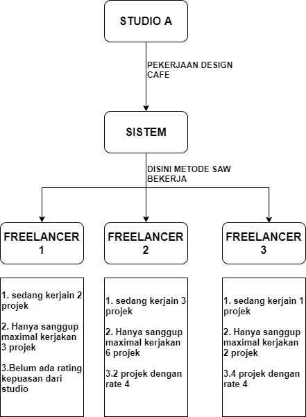

# Sistem Pendukung Keputusan Dengan Menggunakan Metode SAW - Medan Software

> PERANCANGAN SISTEM PENDUKUNG KEPUTUSAN PEMBAGIAN PROJEK DENGAN MENGGUNAKAN METODE SIMPLE ADDITIVE WEIGHTING (SAW) BERBASIS WEBSITE PADA PERUSAHAAN KAMISPACE

1.Jumlah banyaknya proyek yg sedang di kerjakan (makin dikit makin besar kemungkinan dia dipilih)
2.Kesanggupan dalam menerima berapa byk projek
3.Nilai kepuasan dari pihak studio arsitek (makin bagus makin besar kemungkinan dia dipilih)

